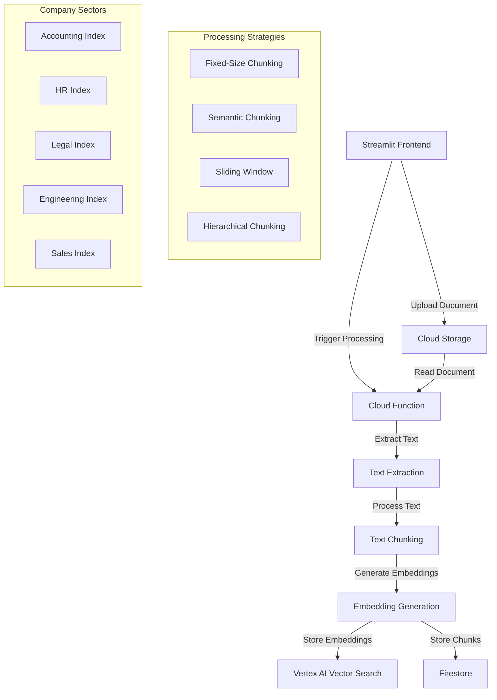

# System Architecture



# Data Flow

```mermaid
sequenceDiagram
    participant User
    participant Streamlit
    participant CloudStorage
    participant CloudFunction
    participant VertexAI
    participant Firestore
    
    User->>Streamlit: Upload Document & Select Sector
    Streamlit->>CloudStorage: Store Document (Sector-Specific Path)
    Streamlit->>CloudFunction: Trigger Processing (With Sector Parameter)
    CloudFunction->>CloudStorage: Retrieve Document
    CloudFunction->>CloudFunction: Extract Text
    CloudFunction->>CloudFunction: Apply Chunking Strategy
    CloudFunction->>VertexAI: Generate Embeddings
    CloudFunction->>VertexAI: Store in Sector-Specific Vector Index
    CloudFunction->>Firestore: Store Chunks & Metadata (With Sector Info)
    CloudFunction->>Streamlit: Return Processing Status
    Streamlit->>User: Display Completion
